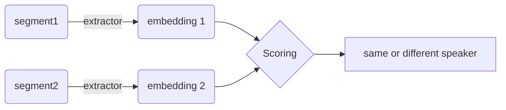

---
layout: pageBar
hideInToc: true
---

# Outline

<Toc/>

<!--
I assume that most of you are not familiar with the speaker diarization task so I will give a brief overview of it, 
what's the objective? how do we evaluate it? what's the general pipeline to do this task?
Then I will focus on a baseline model called VBx. I will its underlying generative model, which involves several aspects: the speaker space, the speaker model and the conversation model. And how do we perform inference with the model.
Finally a little words on the future work I plan.
-->

---
layout: pageBar
---

# Overview
What is Speaker Diarization?

## Objective: Decide who speaks when
- Who: *Identify* the active speakers.

- When: Find the *boundary* of their speech/voice activity.

<v-click>

## Output: Rich Transcription Time Marked (RTTM) files
A csv file where each line contains an audio segment's information: <br> file type, file name, channel ID, begin time, duration, speaker ID.

```csv
SPEAKER ES2005a 1 0.000000 7.800000 <NA> <NA> 20 <NA> <NA>
SPEAKER ES2005a 1 7.800000 5.760000 <NA> <NA> 13 <NA> <NA>
SPEAKER ES2005a 1 13.560000 6.720000 <NA> <NA> 20 <NA> <NA>
```
</v-click>

---
layout: pageBar
hideInToc: true
---
# Overview
<br>

## Particularity of SD: 
- ~~supervised learning / classification problem: finite number and in-domain speakers.~~
- Unsupervised learning / clustering problem: indetermined number, out-of-domain speakers

<v-click>

## Comparison to other audio tasks:

- voice activity detection (binary classification, indifferent to speaker identity)
- automatic speech recognition (closed-class, supervised learning, soft annotations)
- sound event detection (more general than verbal activities)
- acoustic unit discovery (acoustic unit instead of speaker identity)
</v-click>

---
layout: pageBar
---

# Evaluation

## Diarization Error Rate (DER)
$$\mathrm{DER}=\frac{\text{false alarm}+\text{missed detection}+\text{speaker confusion}}{\text{ground truth duration}}$$

- False Alarm: a frame is annotated to speech while it isn't.
- Missed: a frame is not annotated to speech while it is. 
- Speaker Confusion: a frame is annotated to one speaker while it is another speaker.

<v-click>

## Specialties
- Who: identifiers are pseudo rather than absolute labels.
  - transform predicted IDs to target IDs that maximizing the overlap.
- When: boundaries are not consistent across different annotators.
  - add forgiving collar to both ends of segments (usually 0.25s).

</v-click>

---
layout: pageBar
---

# General Pipeline
<br>


<br>

<v-clicks>

- Traditional System: modular optimization but correlated
- Jointly optimization system: merge several blocks with joint optimization objectives
- End-to-end system: deep neural network
</v-clicks>

<br>
<v-click>
<div class="text-28px">Particularly we focus on VBx system.</div>
</v-click>

---
layout: pageBar
---
# The generative model for SD in VBx

<div class="grid grid-cols-3 gap-5">

<div class="col-span-1 flex flex-col">
<h3 class="mb-4">Graph model</h3>


</div>
<div class="col-span-2 flex flex-col">
<h3 class="mb-4">Formulation</h3>

$$
\begin{aligned}p(\mathbf{X},\mathbf{Z},\mathbf{Y})& =p(\mathbf{X}|\mathbf{Z},\mathbf{Y})p(\mathbf{Z})p(\mathbf{Y})  \\ 
&=\prod_np\left(\mathbf{x}_t|z_t\right)\prod_np\left(z_t|z_{t-1}\right)\prod_sp\left(\mathbf{y}_s\right)\end{aligned}
$$

<h3>Interpretation</h3>

At each time frame $t$, a speaker $z_t=s$ is activated according to a **conversation model** $p(z_t|z_{t-1})$, whose speaker embedding $\mathbf{y}_s$ lies in a **speaker space**, then a noisy observation of speaker embedding, i.e. the speech segment embedding $\mathbf{x}_t$ is emitted from a **speaker model** $p(\mathbf{x}_t|z_t=s)=p(\mathbf{x}_t|\mathbf{y}_s)$.<br><br>
Hence the speaker diarization task is equivalent to solve $p(\mathbf{Z}|\mathbf{X})$
</div>

</div>

---
layout: pageBar
---

# Speaker space: feature extraction
Representation and comparison of audio segments

<v-click>

Speech is a mixture of different information: acoustic, semantic, prosody, **speaker identity**, etc.

</v-click>

<v-click>

### Embedding
- i-vector: traditional representation extracted by factor analysis
- x-vector: robust neural representation trained on large augmented corpus (noises, reverberation...)
  - Frontend: MFCC, filter banks, Wav2Vec, WavLM...
  - Backend: ResNet, ECAPA-TDNN...
  - Loss: cross entropy, aam loss, circle loss...

</v-click>

<v-click>

### Scoring

<div class="w-150">

</div>
</v-click>

<!--
So first element is the speaker space
-->

---
layout: pageBar
---
# Speaker Model: PLDA
How speakers are distributed in the feature space
<br>

## Formulation
We need to deal with two types of variability of the representation: different speakers and different speech segments of the same speaker.

$$
\begin{aligned}
P(\mathbf{y})&=\mathcal{N}(\mathbf{y}\mid\mathbf{m},\Phi_b)\\
P(\mathbf{x}\mid\mathbf{y})&=\mathcal{N}(\mathbf{x}\mid\mathbf{y},\Phi_w)\\
\end{aligned}
$$

$\Phi_w$: the within-class variance, characterize how speaker differs from each other.<br>
$\Phi_b$: the between-class variance, characterize how speech differs within the same speaker.

### About naming
- Linear discriminant analysis by Gaussian Mixture point of view
- Generalize mixture prior from a finite sum of Dirac to a continuous Gaussian

---
layout: pageBar
---
# Conversation model: Markov Chain
How speakers take turns in the conversation
<div class="grid grid-cols-3 gap-5">

<div class="col-span-1 flex flex-col">
<h3 class="mb-4">Topology</h3>


</div>
<div class="col-span-2 flex flex-col">
<h3 class="mb-4">Formulation</h3>

$$
p(z_t=s|z_{t-1}=s')=p(s|s')=(1-P_{loop})\pi_s+\delta(s=s')P_{loop}
$$

- Homogeneous along the time
- one speaker per time frame, unable to deal with multiple speakers (overlap speech)
</div>

</div>

---
layout: pageBar
---
# VBx = HMM + PLDA
<br>

## Combined Model
$$
\begin{aligned}p(\mathbf{X},\mathbf{Z},\mathbf{Y})& =p(\mathbf{X}|\mathbf{Z},\mathbf{Y})p(\mathbf{Z})p(\mathbf{Y})  \\ &=\prod_tp\left(\mathbf{x}_t|z_t\right)\prod_tp\left(z_t|z_{t-1}\right)\prod_sp\left(\mathbf{y}_s\right)\end{aligned}
$$
where
$$
\begin{aligned}p(\mathbf{y}_s)&=\mathcal{N}(\mathbf{y}_s;\mathbf{0},\mathbf{I})\\p(\mathbf{x}_t|z_t=s)=p(\mathbf{x}_t|\mathbf{y}_s)&=\mathcal{N}(\mathbf{x}_t;\mathbf{V}\mathbf{y}_s,\mathbf{I})\\p(z_t=s|z_{t-1}=s')&=p(s|s')\\p(s|s')&=(1-P_{loop})\pi_s+\delta(s=s')P_{loop}\end{aligned}
$$

---
layout: pageBar
---
# Variational Inference
<br>

In order to compute the intractable $p(\mathbf{Z}|\mathbf{X})=\int p(\mathbf{Z},\mathbf{Y}|\mathbf{X})d\mathbf{Y}$, we need variational inference.<br>

1. Surrogate model $q(\bold{Y,Z})$ for $p(\bold{Z,Y|X})$, compute the ELBO function
$$\mathcal{L}\left(q(\mathbf{Y},\mathbf{Z})\right)= E_{q(\mathbf{Y},\mathbf{Z})}\left\{\ln\left(\frac{p(\mathbf{X},\mathbf{Y},\mathbf{Z})}{q(\mathbf{Y},\mathbf{Z})}\right)\right\}$$
2. Mean-field approximation to factorize $\bold{Y,Z}$, i.e. $q(\bold{Y,Z})=q(\bold{Y})q(\bold{Z})$
3. Together with the independency $\bold{Y}\perp\!\!\!\perp\bold{Z}$, we can further factorize it to
$$
\mathcal{L}\left(q(\mathbf{Y},\mathbf{Z})\right)=\textcolor{red}{F_A} E_{q(\mathbf{Y},\mathbf{Z})}\left[\ln p(\mathbf{X}|\mathbf{Y},\mathbf{Z})\right]+\textcolor{red}{F_B}E_{q(\mathbf{Y})}\left[\ln\frac{p(\mathbf{Y})}{q(\mathbf{Y})}\right]+E_{q(\mathbf{Z})}\left[\ln\frac{p(\mathbf{Z})}{q(\mathbf{Z})}\right]
$$
with two hyper-parameters as a counter-effect of our assumptions.

---
layout: pageBar
hideInToc: true
---
# Variational Inference
<br>

4. Solving the functional calculus equation $\frac{\delta \mathcal{L}}{\delta q} = 0$, we get

$$
\begin{aligned}\ln q(\mathbf{Y})&=\frac{F_A}{F_B}E_{q(\mathbf{Z})}\left[\ln p(\mathbf{X}|\mathbf{Y},\mathbf{Z})\right]+\ln p(\mathbf{Y})+const\\\ln q(\mathbf{Z})&=F_AE_{q(\mathbf{Y})}\left[\ln p(\mathbf{X}|\mathbf{Y},\mathbf{Z})\right]+\ln p(\mathbf{Z})+const\end{aligned}
$$
where the surrogate prior $q(Y)$ and $q(Z)$ are mutually dependent, hence can be iteratively optimized.

5. (VBEM) Iteratively optimize $q(\mathbf{Y})$ and $q(\mathbf{Z})$:
  - crucial quantity: $q(z_t=s)$, marginal distribution of speaker at time $t$.
  - $q(\mathbf{Y})$ part: relatively easy, product of Gaussian factors $q(\mathbf{Y_s})$.
  - $q(\mathbf{Z})$ part: a surrogate HMM hence involving Baum-Welch algorithm.
  - <span class="text-red">Fact: GMM-HMM is solvable by EM, PLDA-HMM as a generalization is solvable by VBEM</span>

6. When ELBO converges, $\argmax_s q(z_t=s)$ is the speaker identity alignment.

---
layout: pageBar
---
# Future work
VBx plays as a baseline

1. Playing with speaker model: regularization, disentanglement
2. Playing with conversation model: deep sequential models instead of HMM
3. Do everything in end-to-end way (EEND): large synthetic data, discriminative training
4. More signal processing inductive bias:
   - $\alpha$-stable process
   - multi-channel spatial information
5. Hint from other level of information: semantic, emotional, articulatory.

<br>

Meanwhile, I try to avoid 💩⛰️ codebases (Kaldi, speechbrain)...

---
layout: end
---
